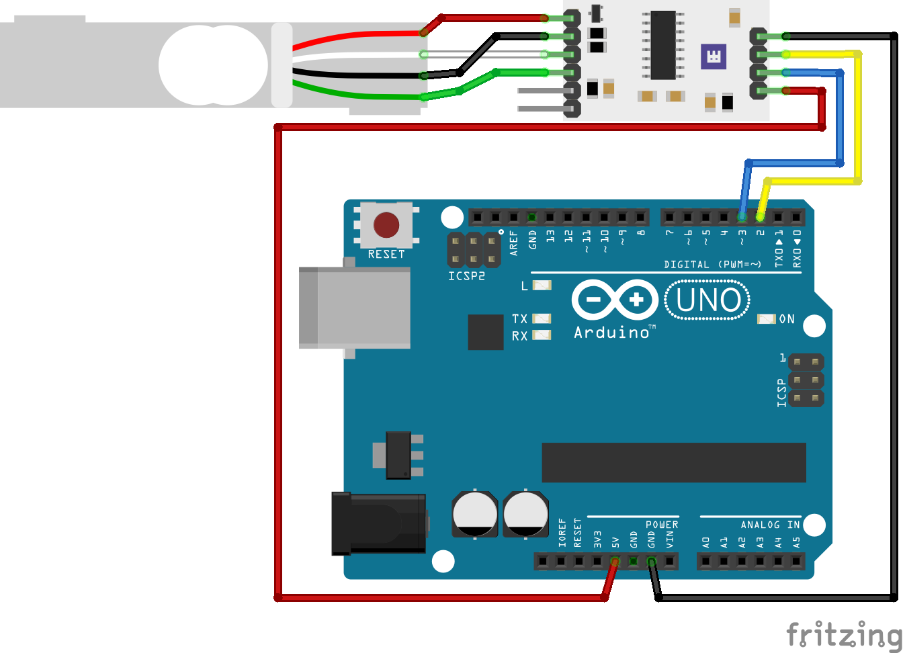

# Whadda Electronic scale load cell example code

This example shows how you can use the Whadda Electronic scale load cell sensor (WPSE471) with an Arduino® compatible board to read the weights measured by the sensor and print the results in the serial monitor.

## Library dependencies
*  HX711 Arduino Library by bogde

## Wiring diagram

## Additional information
  For more information about the Whadda Electronic scale load cell sensor (WPSE471), check the manual available at [whadda.com](https://whadda.com)

## Acknowledgments
**Calibration sketch based on:** 

Example using the SparkFun HX711 breakout board with a scale

By: Nathan Seidle

SparkFun Electronics

Date: November 19th, 2014

License: This code is public domain but you buy me a beer if you use this and we meet someday (Beerware license).

**Read_weight sketch based on:**

demo program for the HX711 library for Arduino

  https://github.com/bogde/HX711

  MIT License

  (c) 2018 Bogdan Necula